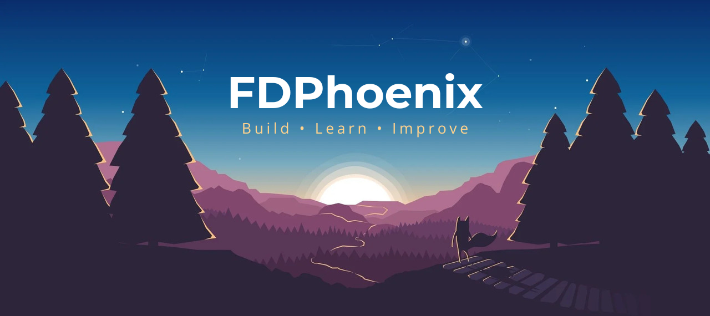

  

---

## 📖 About Me

- 💡 A passionate **Software Developer** interested in both **Frontend** and **Backend**
- 🔁 Comfortable working across the stack: UI, API, database, deployment
- 📚 Always eager to learn new tools, frameworks, and best practices
- 🎯 Goal: Build real-world products with clean, scalable, and maintainable code
- 🌏 Based in Vietnam

---

## 🛠️ Tech Stack

 &nbsp; &nbsp;
 &nbsp; &nbsp;
 &nbsp; &nbsp;
 &nbsp; &nbsp;
 &nbsp; &nbsp;
 &nbsp; &nbsp;
 &nbsp; &nbsp;
 &nbsp; &nbsp;

 &nbsp; &nbsp;
 &nbsp; &nbsp;
 &nbsp; &nbsp;
 &nbsp; &nbsp;
 &nbsp; &nbsp;
 &nbsp; &nbsp;

---

## 📌 What I'm Working On

- 🔨 Building personal & academic projects
- 🧠 Improving system design & clean architecture
- 🔐 Learning more about security, performance, and scalability

---

## 📊 GitHub Stats

  

  
  

---

## 📫 Connect With Me

- 📧 Email: **khanghuynhfdp@gmail.com**
- 💼 GitHub: [https://github.com/FDPhoenix](https://github.com/FDPhoenix)

---

  ✨ “Code. Learn. Improve. Repeat.” ✨

